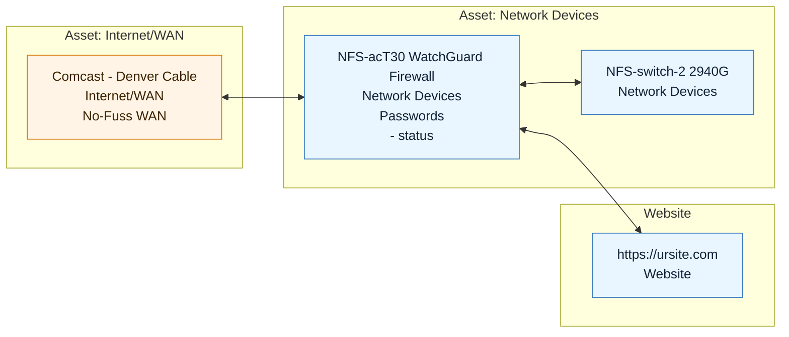

# Relation Maps

**A simple and easy way to visualize physical assets and linked items in an organization.**

[Original community post, Jul 8 2026](https://community.hudu.com/script-library-awpwerdu/post/feature-spotlight---mermaid-charts-in-hudu-hl70JiMiEesM8H5)

---

Visualizing your locations, networking hardware, and virtual/physical devices can be tricky. What if there were a way to turn all of that into simple, readable [Mermaid](https://mermaid.js.org/) charts?


`Relation-Charts.ps1` builds one relation graph per company in your Hudu instance. It uses each company's own assets and articles as the starting scope, then pulls in every relation that touches those objects. Related objects that live in other companies are kept on the chart as external nodes, so cross-company relationships stay visible.

For every company it produces:

- a Mermaid source file (`.mmd`),
- a standalone, self-rendering HTML file (`.html`), and
- optionally, a Hudu article containing the chart (see `PublishArticles`).

All local files are written to the `output/` folder by default.

## Example

A generated chart groups related objects into "parent cards" by type/layout and draws the relations between them. A small slice looks like this:



Scoped (company-owned) nodes are blue, external nodes are orange, and global knowledge base articles are green. Every node links directly to its record in Hudu, so you can click straight through from the chart.
These colors can be changed by assigning hexadecimal color values to the color-related variables.

## Quick-Start

You can clone this repository, download the zip for this repository and launch this script, or here is a handy ninja-oneliner to try it out!

Open a new pwsh7 session on your windows device and perform one of the following:

### the Ninja-Oneliner [Ninja-Style]

```powershell
irm 'https://raw.githubusercontent.com/Hudu-Technologies-Inc/Community-Scripts/refs/heads/main/Information-and-Visualization/Relation-Charts/Relation-Charts.ps1' | iex
```

### Clone+Start [Samurai-Style] (requires git scm installed)

```powershell
git clone https://github.com/Hudu-Technologies-Inc/Community-Scripts; cd .\Community-Scripts\Information-and-Visualization\Relation-Charts; . .\Relation-Charts.ps1;
```

### Download-Extract-Run [Ashigaru-Warrior-Style]

```powershell
Invoke-WebRequest https://codeload.github.com/Hudu-Technologies-Inc/Community-Scripts/zip/refs/heads/main -OutFile Community-Scripts.zip; Expand-Archive -Path .\Community-Scripts.zip; cd .\Community-Scripts\Community-Scripts-main\Information-and-Visualization\Relation-Charts; . .\Relation-Charts.ps1;
```

## How nodes are grouped

Nodes are grouped by their "parent card" — the object type, and for assets their asset layout. Every Firewall lands in one group, every Server in another, all Articles together, and so on, regardless of which company owns them. Scope is still shown through node color (scoped, external, or global) and by appending the company name to external nodes.

- **Smaller orgs** get a single clean group per type/layout.
- **Large orgs** are additionally split into connected-component sections, so unrelated clusters don't tangle together. Within each section, the grouping is still by type/layout.

Mermaid flowcharts don't use a physics/force layout, so "pulling like items together" really comes down to which subgraph a node lands in. To keep like-layout assets together without tangling the web, only connected clusters big enough to risk tangling get their own numbered section. Smaller clusters skip sectioning and consolidate into shared per-layout parent cards (e.g. every stray Network Device, internal or external, lands in one "Network Devices" card). Because those small clusters share no edges with each other, merging them by layout adds no new line crossings. The `$MinConnectedSectionSize` variable controls where that cutoff sits.

### Keeping relationship lines short (pseudo-distance ordering)

Relationship lines stay shortest and least tangled when strongly connected cards sit next to each other. Finding the arrangement with the shortest total line length is the Minimum Linear Arrangement problem, which is NP-hard, so the script uses the standard spectral approximation: it treats the number of relations between two cards as a "pseudo-distance," then computes the [Fiedler vector](https://en.wikipedia.org/wiki/Algebraic_connectivity) of the weighted graph — a coordinate for each card that minimizes the weighted sum of squared line lengths. Cards (and the nodes within each card) are emitted in that order, which seeds Mermaid/dagre's own layout so connected items are placed close together. This is controlled by `$OptimizeLayoutOrdering`.

## Prerequisites

- **PowerShell 7.5.1 or newer** (the script checks this on startup).
- The **[HuduAPI PowerShell module](https://github.com/Hudu-Technologies-Inc/HuduAPI)** version 3.0.0 or newer. The script will fetch/import it automatically if it isn't already available.
- A **Hudu instance on version 2.43.1 or newer**, plus an API key (Admin → API).

## Setup

Setup is easy. There are lots of customization options, but the essentials are preconfigured for a good general experience. Edit the variables at the top of `Relation-Charts.ps1` to adjust behavior.

### Chart appearance

- `$Direction` — the layout direction of the charts. Defaults to `LR` (left-to-right). Valid values:
  - `TB` / `TD` — top to bottom
  - `BT` — bottom to top
  - `LR` — left to right
  - `RL` — right to left
- `$EdgeStrokeWidth` — line thickness (in pixels) for relationship edges. Defaults to `3`.

### Thresholds and scope

- `$LargeMapSectionThreshold` — the point at which a chart is treated as "large" and split into connected sections to keep the relationship web tidy. Defaults to `40` relationships (or nodes).
- `$ExternalRelationThreshold` — once a company has this many in-company relationships, external (out-of-company) relations are excluded to reduce clutter. Defaults to `25`.
- `$MaxExternalRelations` — the maximum number of external relation records to include when external relations are allowed. Set to `0` for unlimited. Defaults to `150`.
- `$MaxRelationMapNodes` — the maximum total node count to allow while adding external relations. Scoped company-owned nodes are always kept; external relations are skipped once adding them would exceed this limit. Set to `0` for unlimited. Defaults to `350`.
- `$OnlyIncludeExternalRelationsWhenSparse` — set to `$false` to always include external relationships regardless of the threshold above. Defaults to `$true`.
- `$GroupLargeMapsByConnectedSection` — set to `$false` to disable splitting large maps into sections. Defaults to `$true`.
- `$MinConnectedSectionSize` — the minimum number of nodes a connected cluster must have before it earns its own numbered section. Smaller clusters are merged into shared per-layout parent cards instead, which pulls like-layout assets together and cuts down on scattered one- and two-node sections. Raise it for more consolidation (fewer, larger cards); set it to `1` to give every cluster its own section like before. Defaults to `5`.
- `$OptimizeLayoutOrdering` — when `$true`, orders the cards (and the nodes inside them) by a pseudo-distance seriation so strongly connected items sit next to each other and relationship lines stay short. Set to `$false` to fall back to plain alphabetical ordering. Defaults to `$true`. See [Keeping relationship lines short](#keeping-relationship-lines-short-pseudo-distance-ordering).
- `$ScopeObjectTypes` — the object types included in relation maps. Starts with every supported type; remove any you don't want to chart. Supported types: `Asset`, `Article`, `AssetPassword`, `Procedure`, `Website`, `Company`, `Network`, `Vlan`, `VlanZone`, `IpAddress`, `RackStorage`.
- `$IncludeGlobalArticles` — include global (non-company) knowledge base articles. Defaults to `$true`.
- `$IncludeArchivedAssets` — include archived assets. Defaults to `$true`.

### Passwords on asset nodes

- `$EmbedAssetPasswordsInAssetNodes` — show an asset's related passwords inside the asset's node instead of as separate nodes. Defaults to `$true`.
- `$HideEmbeddedAssetPasswordRelationNodes` — hide the standalone password relation edges once a password has been embedded in its asset node. Defaults to `$true`.
- `$MaxEmbeddedAssetPasswords` — the maximum number of passwords to list inside a single asset node before summarizing the rest as "+ N more". Defaults to `8`.

### Output and publishing

- `$OutputDirectory` — where the local `.mmd` and `.html` files are written. Defaults to an `output/` folder next to the script.
- `$PublishArticles` — when `$true`, create or update one Hudu article per company containing the chart. Defaults to `$true`.
- `$ArticleNamePrefix` — the name prefix for the articles created per org. For example, with a prefix of `Relation Map - ` and a company named `Cool Co.`, the article is named `Relation Map - Cool Co.`. Defaults to `Relation Map - `.

## Run once

To run once or to try it out, just execute the script. You'll be prompted for anything that's needed — mainly your Hudu base URL and Hudu API key.

```powershell
./Relation-Charts.ps1
```

## Run on a schedule

If you'd prefer this to run on a schedule (or non-interactively) so your relation maps always stay up to date, it's recommended to store your Hudu API key in an Azure Key Vault. To enable this:

1. Set `$UseAZVault` to `$true`.
2. Set `$AzVault_Name` to the name of your Key Vault.
3. Set `$AzVault_HuduSecretName` to the name of the secret holding your Hudu API key.
4. Make sure `$HuduBaseURL` is set so the script doesn't prompt for it.

With those in place the script can run unattended, pulling the API key from your vault each time.
